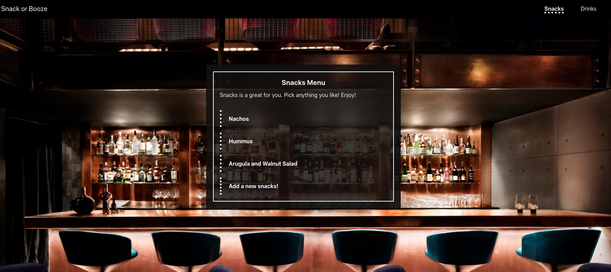
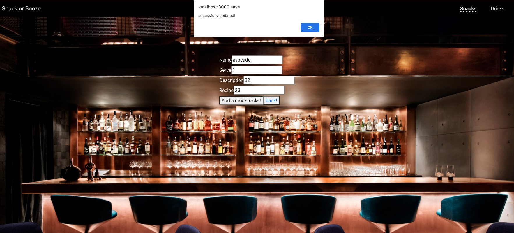
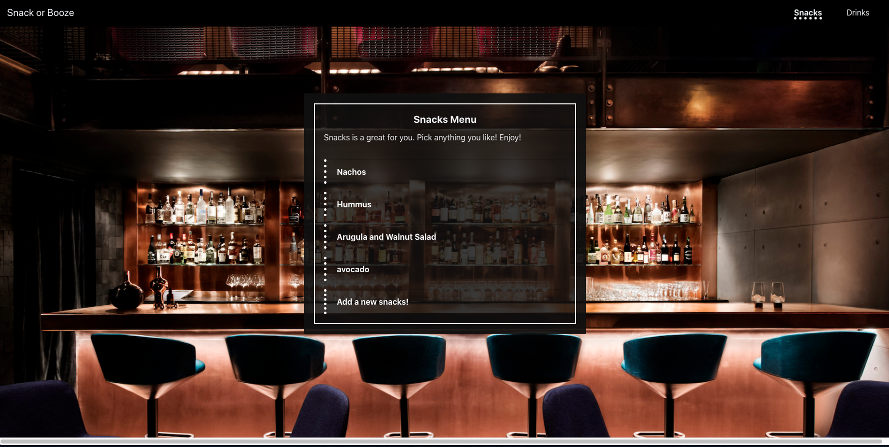
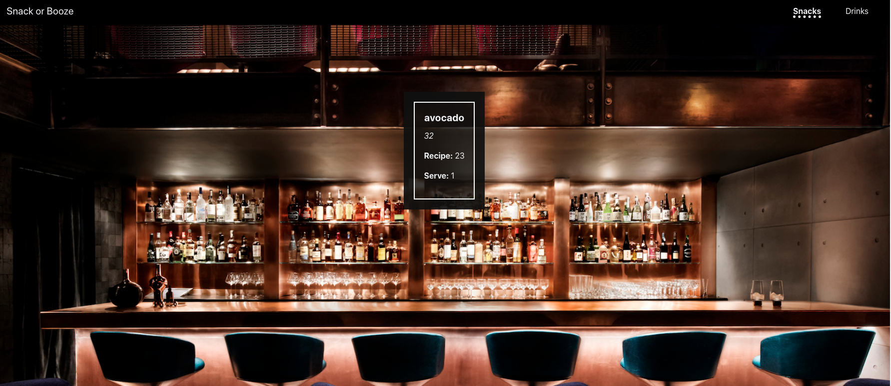
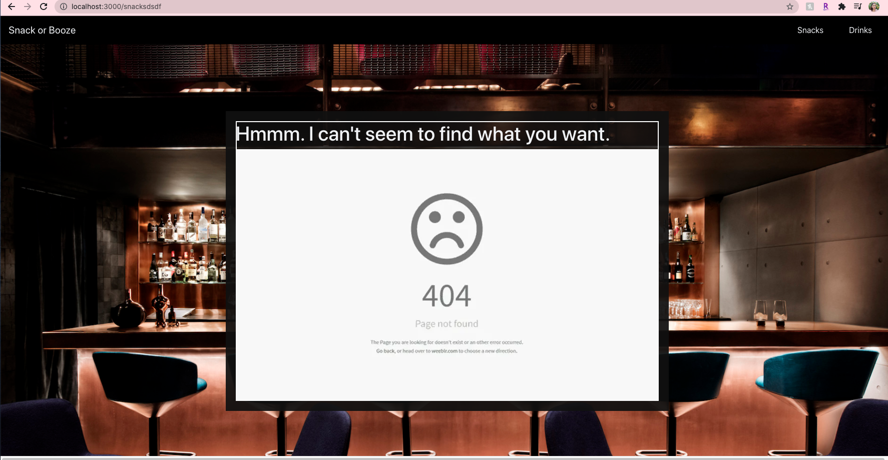

# Snack-Or-Booze

https://snack-or-booze-menu.herokuapp.com/

## Description

It is the assessment for springboard react. It is a cafe page which can show the drink items, snack items.

## Starting Up

Run npm i to install the dependencies and npm start to start the server.
The front end code will be available at http://localhost:3000
The back end code will be avialble at http://localhost:5000.

## Tasks

- The homepage should show the food items (“snacks”) and drink choices (“drinks”)
- The navbar should add a new link, “Drinks”, leading to a page listing the drinks — just like the “Snacks” link leads to a page listing food items.
- The drink listing page should show a list of drink choices, with each being a link to the details about the drink, just like for food items.
- turn these into generic components that can work with either food or drink lists/items.
- add a page that lets site users add either a drink or a snack.
- Make sure there is a 404 page.

## Preview

HomePage

Snacks route, it lists the snacks and you can open for snack description.

You can open a add a item form by the end.

You can check the successful addded item and view the description.

When you check an unexisting route, it will show a customzied 404 page.

## Code design

- There are two hooks: One is itemHook, which uses for displaying specific item details.( drinks for snacks).
  Another is menu hook: It is designed for displaying the menu (show the list of items).
- The navbar render the homepage nav links.
- The add item form is for adding items and it is herited add function from parent App.js.
- App.js has the main nav bar and it is the whole parent of all the the components. You also can find browswer routes definitions there.
